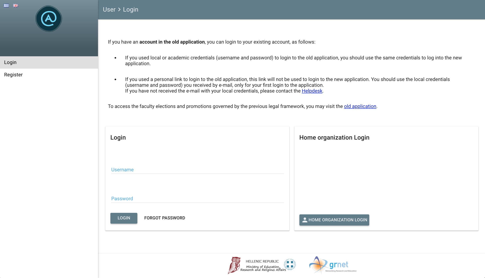
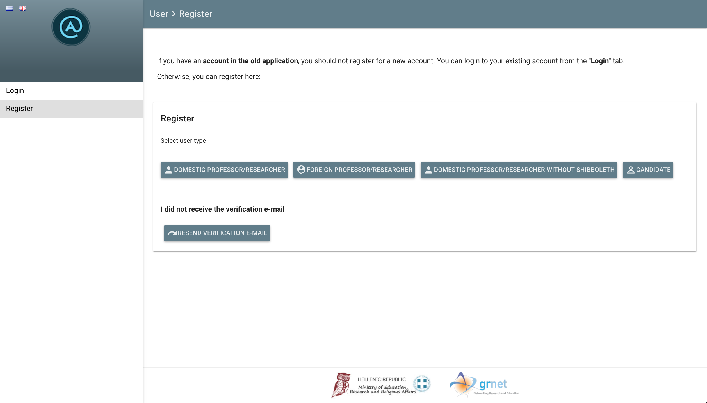
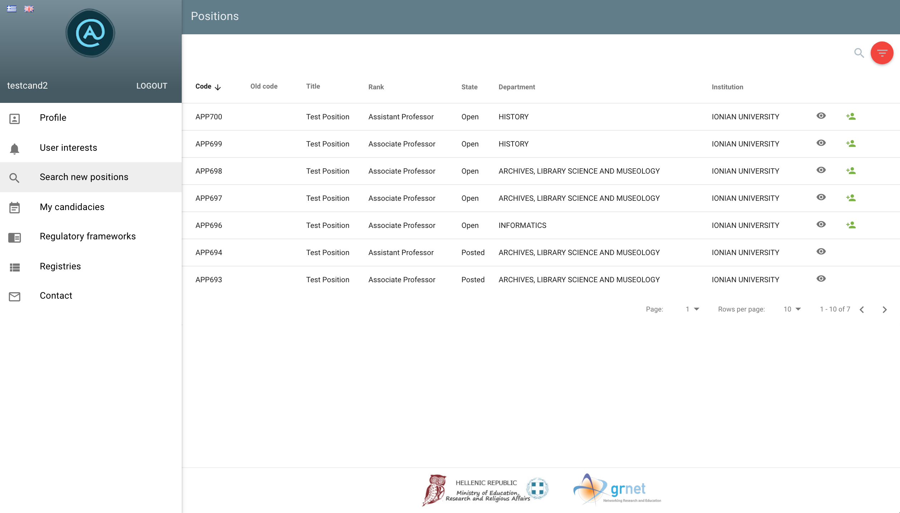
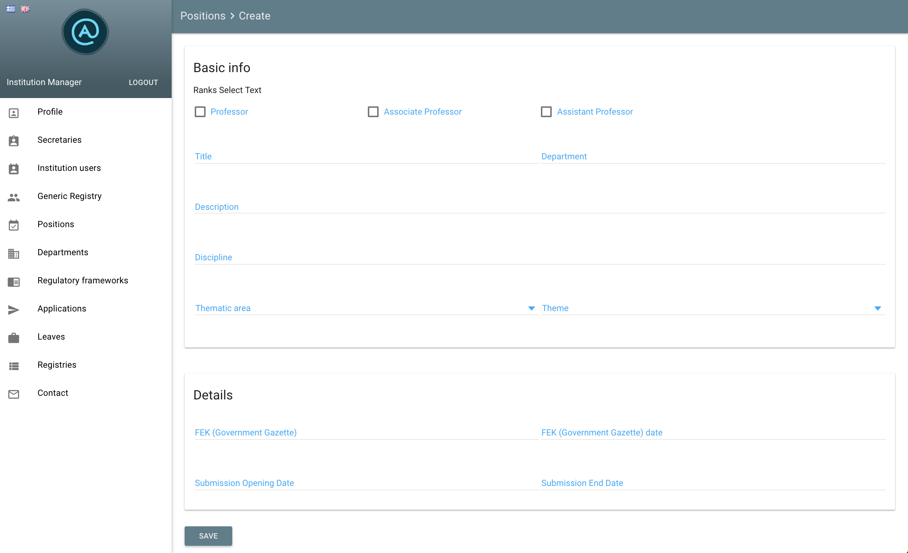

# Apella

The electronic service [Apella](https://service-apella.grnet.gr/apella/ui/) provides for the centralized management of faculty elections and promotions, as well as the compilation and maintenance of the registries of the internal and external evaluation members of the Greek Higher Educational Institutions.

## Prerequisites

* Python 2.7
* git
* pip
* NodeJS
* Yarn


## Development instructions

### Backend installation

#### Getting the repo and installing dependencies

* Clone this repo and checkout to `develop` branch
* Install python dependencies (it's highly recommended to use a virtualenv)
```
$ pip install -r requirements.txt
```

#### Configuration

* Create a `settings.conf` file. The default path for it is `/etc/apella`. The path can be overriden by setting the `APELLA_SETTINGS_DIR` shell variable. This file overrides Django's `settings.py` and it should contain at least the following lines (change IP accordingly):
```
ALLOWED_HOSTS = [u'SERVICE.IP.HERE', u'127.0.0.1']
EMAIL_BACKEND = 'django.core.mail.backends.filebased.EmailBackend'
EMAIL_FILE_PATH = DATA_DIR
```
Consider also setting `DEBUG` and `TEMPLATE_DEBUG` to True.

* Create a file named `evaluators_allow_addr` in the same folder as `settings.conf` and write in it the following (changing the IP):
```
[u'SERVICE.IP.HERE', u'127.0.0.1']
```
* Create a file named `evaluators_auth_token` in the root folder of the repo and add the following token in it:
```
1234567890
```
* Create an `apella.log` file. The default path for it is `/var/log/apella/apella.log`. The path can be overriden by setting the `APELLA_LOGFILE` shell variable.
* Create a data folder for the uploaded files and sent emails. The default path for it is `/var/lib/apella/data`. The path can be overriden by setting the `APELLA_DATA_DIR` shell variable.
* The service also expects a resources directory at `/usr/lib/apella/resources`. Those resources can be found in the resources directory in the root folder of the repo. The path can be overriden by setting the `APELLA_RESOURCES_DIR` shell variable.

#### Database initialization

* Initialize database
```
$ python manage.py migrate
```

#### Adding dummy data (Optional)

* Before adding data you may alter the passwords of the users that will be created. To do so, create a json file with the passwords and set the `APELLA_PASSWORD_FROM_JSON` environment variable to point to it. An example file is `passwords.json` in the `resources` directory. The default username-password combinations are listed below:
```
helpdeskadmin : 12345
helpdeskuser  : 12345
manager       : 12345
manager2      : 12345
assistant     : 12345
assistant2    : 12345
assistant3    : 12345
candidate     : 12345
professor     : 12345
committee     : 12345
```
* To add dummy data to the database run the following command.
```
$ python run_transcript.py transcript.json
```

#### Running the server

* Use the following command:
```
$ python manage.py runserver
```
You can now view your api at [http://127.0.0.1:8000/apella/api/](http://127.0.0.1:8000/apella/api/)


## Frontend installation

### Install requirements

* Install dependencies by running `yarn`
```
$ cd ui
$ yarn
```
* When yarn finishes, run `bower install` in order to install all bower components required (use the `--allow-root` option if required).
```
$ ./node_modules/.bin/bower install
```

* Build static files
```
$ ember build --watch --environment=development
```

You can now view the full app at [http://127.0.0.1:8000/](http://127.0.0.1:8000/)


## Screenshots

Below are some screenshots from an existing installation of Apella.
You can view the login and the register pages, as well as a list of all open and posted positions that a candidate can view and a position creation form for an institution manager.

|  |
|:--:|
| Login |

|  |
|:--:|
| Register |

|  |
|:--:|
| Positions list |

|  |
|:--:|
| Position create screen |


## Copyright and license


Copyright (C) 2017-2018 GRNET S.A.

This program is free software: you can redistribute it and/or modify
it under the terms of the GNU Affero General Public License as
published by the Free Software Foundation, either version 3 of the
License, or (at your option) any later version.

This program is distributed in the hope that it will be useful,
but WITHOUT ANY WARRANTY; without even the implied warranty of
MERCHANTABILITY or FITNESS FOR A PARTICULAR PURPOSE.  See the
GNU Affero General Public License for more details.

You should have received a copy of the GNU Affero General Public License
along with this program.  If not, see [http://www.gnu.org/licenses/](http://www.gnu.org/licenses/).
